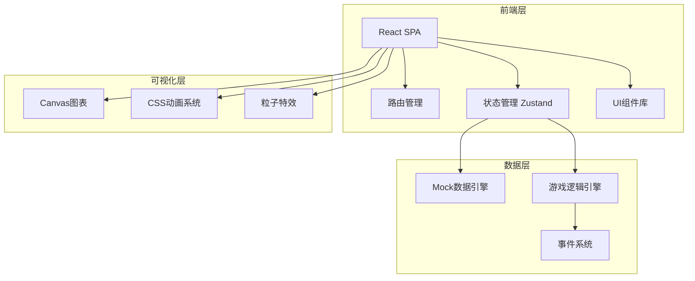
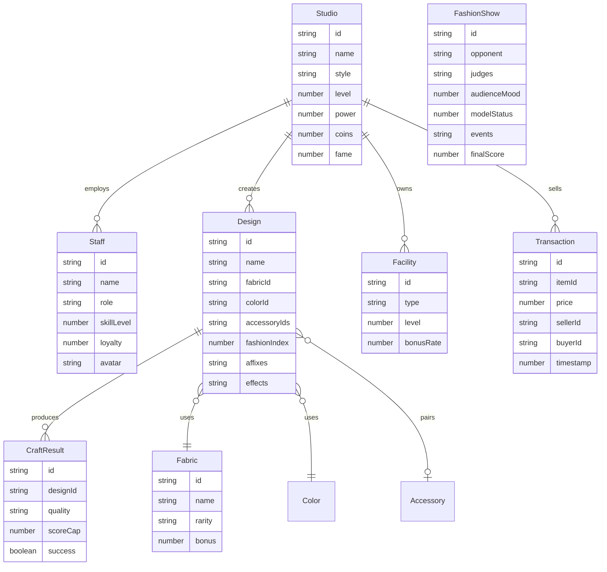

## 1. 架构设计



## 2. 技术说明
- 前端：React@18 + TypeScript + TailwindCSS@3 + Vite
- 初始化工具：vite-init (react-ts 模板)
- 后端：无（纯前端项目，使用Mock数据模拟）
- 数据库：无（使用Zustand状态管理 + localStorage持久化）
- 图表：recharts（热力图、折线图、雷达图等）
- 动画：framer-motion（页面切换、交互动画）
- 粒子特效：tsparticles（流光/星空等特效）
- PDF导出：html2canvas + jspdf

## 3. 路由定义
| 路由 | 用途 |
|------|------|
| / | 总控台 - 工作室概览与快捷入口 |
| /studio | 工作室管理 - 风格/布局/员工/招聘 |
| /design | 设计工坊 - 面料/颜色/配饰/时尚指数 |
| /craft | 制作车间 - 材料/成功率/品质判定 |
| /show | 时装秀 - 联赛/走秀/实时事件 |
| /trade | 交易中心 - 上架/市场/公告 |
| /upgrade | 升级扩建 - 设施/权限 |
| /report | 运营报告 - 热力图/曲线/PDF |
| /ranking | 排行榜 - 全服排名 |

## 4. 数据模型

### 4.1 数据模型定义



### 4.2 核心数据结构定义

```typescript
type StyleType = "ancient" | "cyber" | "nature"
type StaffRole = "designer" | "model" | "tailor"
type Quality = "common" | "fine" | "epic" | "legendary"
type AffixType = "luminous" | "starry" | "phantom" | "aurora" | "void"

interface Studio {
  id: string
  name: string
  style: StyleType
  level: number
  power: number
  coins: number
  fame: number
  materials: Record<string, number>
}

interface Staff {
  id: string
  name: string
  role: StaffRole
  skillLevel: number
  loyalty: number
  avatar: string
  studioId: string
}

interface Design {
  id: string
  name: string
  fabricId: string
  colorId: string
  accessoryIds: string[]
  fashionIndex: number
  affixes: AffixType[]
  effects: string[]
  studioId: string
}

interface CraftResult {
  id: string
  designId: string
  quality: Quality
  scoreCap: number
  success: boolean
  returnedMaterials?: Record<string, number>
}

interface Facility {
  id: string
  type: "designTable" | "sewingMachine" | "studio"
  level: number
  bonusRate: number
}

interface FashionShowEvent {
  type: "wardrobe_malfunction" | "model_nervous" | "audience_boom" | "judge_favor"
  description: string
  impact: number
  timestamp: number
}

interface Transaction {
  id: string
  itemId: string
  itemType: "clothing" | "blueprint"
  price: number
  suggestedMin: number
  suggestedMax: number
  sellerId: string
  buyerId?: string
  timestamp: number
  completed: boolean
}
```

## 5. 游戏逻辑引擎

### 5.1 时尚指数计算
```
基础分 = 面料属性分 + 颜色和谐度分 + 配饰匹配度分
风格加成 = 基础分 × 风格匹配系数(0.8~1.5)
设计师加成 = 基础分 × (1 + 设计师技能等级 × 0.05)
时尚指数 = 基础分 × 风格加成 × 设计师加成
```

### 5.2 稀有词缀触发概率
```
基础概率 = 时尚指数 / 1000
稀有度修正 = 1 + 面料稀有度 × 0.1
最终概率 = min(基础概率 × 稀有度修正, 0.35)
```

### 5.3 制作成功率
```
基础成功率 = 0.5
裁缝加成 = 裁缝技能等级 × 0.03
设备加成 = 设备等级 × 0.05
最终成功率 = min(基础成功率 + 裁缝加成 + 设备加成, 0.95)
失败返还 = 消耗材料 × 0.3
```

### 5.4 品质判定
```
品质阈值 = 随机数(0,1) × 时尚指数
传说: 品质阈值 > 900
史诗: 品质阈值 > 600
精良: 品质阈值 > 300
普通: 其余
```

### 5.5 走秀评分
```
最终评分 = 时尚指数 × 0.4 + 观众投票分 × 0.3 + 评委分 × 0.3
突发事件修正 = 最终评分 × (1 + 事件影响值)
技能修正 = 最终评分 × (1 + 技能效果值)
```
